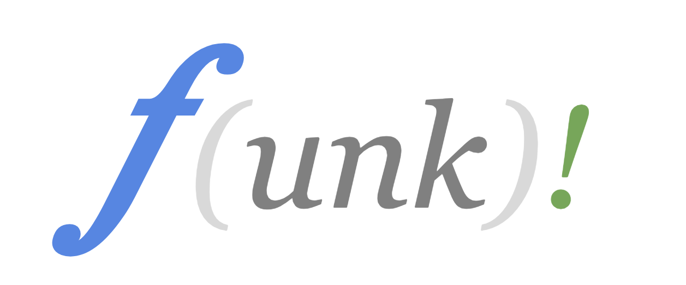

# funk
*Functional Programming Language Experiment*

Funk is an experimental functional programming language, inspired by Erlang and Python.

The goal of Funk is not to be efficient or safe, but rather to be simple and easy to read. 

The Funk compiler translates to LLVM code, such that an executable file for the target platform can be created.

Please note the the state of this project is **under early stages of development**.

# Toolchain installation

Install the python requirements:
```
pip install -r requirements.txt 
```

Install **llvm** toolchain:

Linux:
```
sudo apt install llvm
```
Mac:
```
brew install --with-toolchain llvm
```
You may also need to install latest command-line tools from https://developer.apple.com/download/more/

# SDL (optional, for graphics examples)

Some examples (e.g. `$FUNK_EXAMPLES_PATH/graphics/barnsly_fern.f`) use SDL via `sdl_simple`. Install SDL2 development headers:

Linux (Debian/Ubuntu):
```
sudo apt install libsdl2-dev
```

macOS (Homebrew):
```
brew install sdl2
```

# Submodules

This repo uses git submodules for:
- `funk/` (core compiler/runtime)
- `stdlib/` (standard library files used via `FUNK_INCLUDE_PATH`)

After cloning, sync and initialize submodules:
```
git submodule sync --recursive
git submodule update --init --recursive
```

If submodule URLs change later, re-sync and update:
```
git submodule sync --recursive
git submodule update --init --recursive
```

To pull the latest changes for all submodules later:
```
git submodule update --remote --recursive
```

`FUNK_INCLUDE_PATH` defaults to `./stdlib` in the `Makefile`.
You still need to set `FUNK_EXAMPLES_PATH` to your examples repo path (for `make tests` / `make examples`).

# Benchmarks

The repository includes cross-language benchmarks (Funk vs Python vs C) and an auto-generated report.

## Run the full benchmark report

```
make bench-report BENCH_RUNS=7 BENCH_WARMUP=2
```

This runs all benchmark workloads and regenerates:

- `benchmarks/benchmarks.md`
- `benchmarks/raw/results.csv`
- `benchmarks/plots/*.svg`

`BENCH_RUNS` controls timed samples per configuration, and `BENCH_WARMUP` controls untimed warmup runs.

## Run individual benchmark workloads

```
make bench-fib-compare
make bench-fib-tr
make bench-concat-compare
make bench-sum-range
make bench-collatz
make bench-mutual-recursion
make bench-fp-dot
make bench-fp-axpy
make bench-fp-triad
```

You can also run fastpath/i32 variants:

```
make bench-fib-fastpath
make bench-concat-fastpath
make bench-fib-i32
make bench-concat-i32
make bench-fib-tr-fastpath
```

## Notes

- Benchmarks use scripts under `scripts/benchmark_*.py`.
- The default benchmark report command uses the local virtualenv python: `./venv_3.11/bin/python`.
- For stable comparisons, avoid running heavy background workloads while benchmarking.

# Quick Language walk-through

## Functions

The most important programming blocks of Funk are functions.

Funk programs are essentially a collection of functions.

Functions are declared using the following syntax:
```
# This here is a function
myFunction(x,y):
     x + y.

```
### Return statements

The last statement of a function is always the return statement. 

In the previous example, the function ```myFunction``` has a single statement, which also happens to be the return statement.

In summary: All functions in Funk have a single return statement, and this is always the last statement of the function.

### Function Arguments

Function arguments in Funk can be any valid symbol. 

This includes variables, lists, and off course other functions.

For example:

```

addMe(x):
   x + 1.
   
useFunctionArg(F, y):
    F(y).
```

### Function clauses

Consider the following snippet.

```
# Calculate Fibonacci, using the naive approach

fibo( 0 ): 0.
fibo( 1 ): 1.
fibo( n ):
    fibo( n - 1 ) + fibo( n - 2 ).

```
This example illustrates how you can specify special function behavior for specific values of the input arguments of a function.

Each of these function definitions for ```fibo``` is called a **function clause***.

The order in which these function clauses are declared is important. 

When the compiler translates your code into LLVM IM, it will use this same order to do the pattern matching.

### Function preconditions

Funk has no *if statements*.

Instead, you use a combination of **function preconditions** and **conditional variable assignments** in order to achieve the same effect as have *if statements*.

Consider the following code:

```

fibo( n | n <= 1 ): n.
fibo( n ):
    fibo( n - 1 ) + fibo( n - 2 ).

```
This example introduces the concept of **function preconditions**. 

For example ``` n | n <= 1``` is read as *'n given that n is less of equal than 1`*. 

**Note**: In Funk a precondition can be any valid boolean statement. 
This includes things like function calls. 
Please note that Funk precondtions are different from Erlang guards. Erlang guarantees that guards are **free from side effects**. 
Funk makes **no such guarantee**, but in exchange, it allows a richer set of expression to be used.


## Variables

All variables in Funk are immutable. 

This means that once you assign a value to a variable, you cannot assign another value, it will result in a runtime error message.

To assign a value to variable you use the following syntax:

```
myFunction(x,y):
    z <- x + y
    z + 1.
```

In this example the variable ```z``` was assigned the value ```x + y```.

Also note that this time ```myFunction``` has 2 statements. 

The compiler does not need a special indentation to distinguish between statements. 

The only requirement is that all statements are well formed, and the last statement in a function is followed by the *dot* terminator ```.```

## Conditional assignments

Conditional assignments are done using the ```<-?``` symbol:

```
x <-?  y % 2 = 0: 1, -1

```

The previous expression can assign either ```1``` or ```-1``` to ```x```, depending on the evaluation of the boolean expression ```y % 2 = 0```.

Also note that unlike Python, in Funk the symbol ```=``` stands for **equality**.


## Lists

Lists are be specified using the following syntax:

```
# create an empty list
my_empty_list <- []

# create a list with integers from 1 to 10
my_list <- [1, 2, 3, 4, 5, 6, 7, 8, 9, 10]
```

Or more succinctly, using a list comprehension like this:

```
# use a list comprehension to quickly create a list
my_list <- [ x | 1 <= x <= 10]

```

### Extracting elements from a list

Funk lists are internally represented as linked lists.

This allows to very easily pop  head element from the list, like so:

```
# pop the first element from my_list and store it in head
head <~ [my_list]
```

Extracting the first element is specially useful to implement recursion, which is fundamental to Funk.

Consider the following code:

```

foreach([],_): 1.

foreach( head <~ [tail], F):
    F(head)
    foreach(tail, F).

```
The previous code shows how the ```<~``` operation can be used as part of the function firm.

Now consider the following snippet:

```
len([]): 0.
len(_<~[t]): 1 + len(t).
```
What is important about the previous snippet is the use of the ```_``` symbol.

This simply means **don't care**, and can be used to discard elements that you don't need.

### Appending/prepending elements into a list

In order to prepend an element to list, you use the following notation:

```
map(_, []): [].
map(F, h <~ [t] ):
       F(h) ~> [map(F, t)]. 
```

Note that you can also use in the opposite side of the array like so:

```
reverse([]): [].
reverse(h<~[t]): [reverse(t)] <~ h.
```

## Using external Functions

You can use functions declared in different files using the ```use``` keyword.

```
use foreach

fbz(x | x % 15 = 0): say(x, ' FizzBuzz') .
fbz(x | x % 3 = 0):  say(x, ' Fizz') .
fbz(x | x % 5 = 0):  say(x, ' Buzz') .
fbz(x) : say(x).

main():
    foreach( [x | 1 <= x <= 100] ,  fbz ).
```

Lastly, there is special function called the ```main``` function.

This function shall take no arguments, and marks the entry point to your program.
