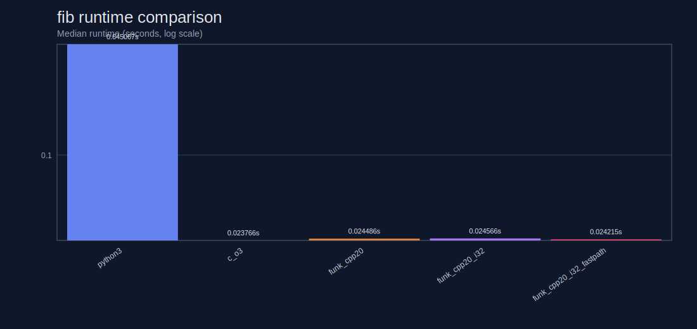
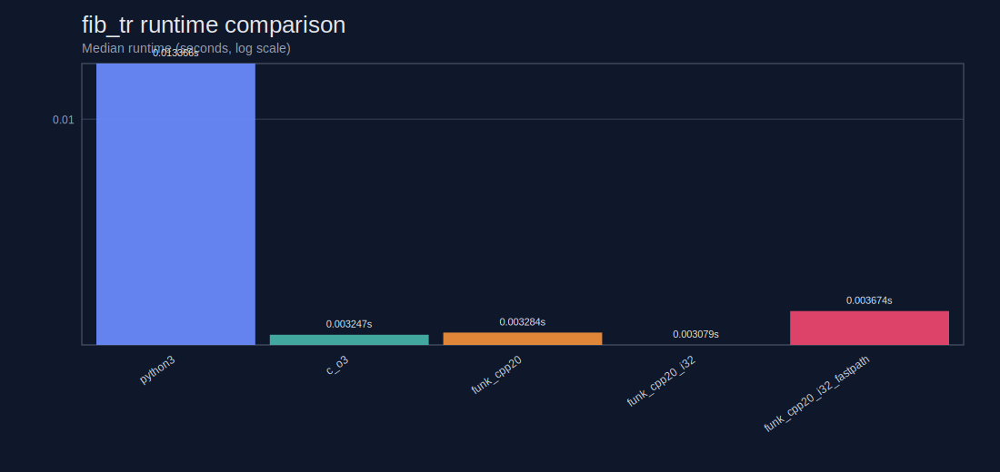
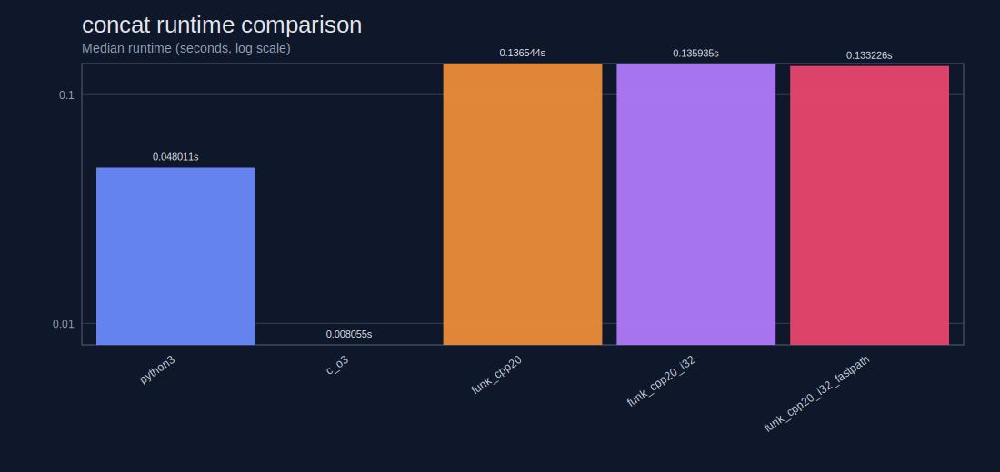
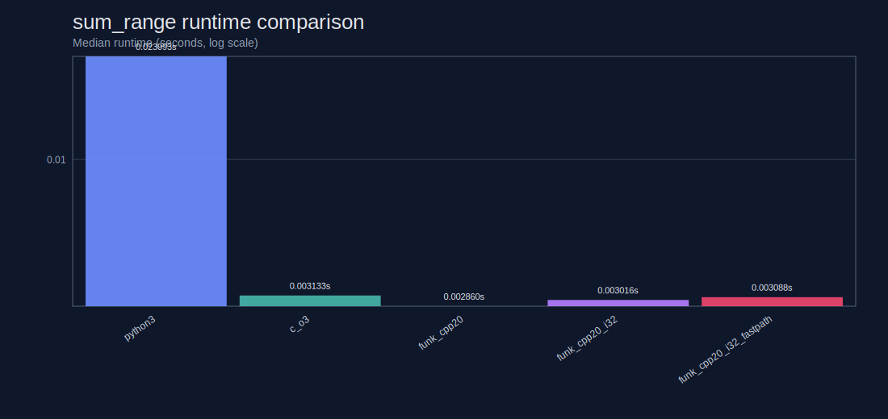
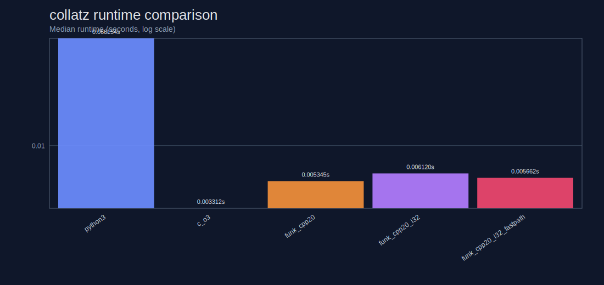
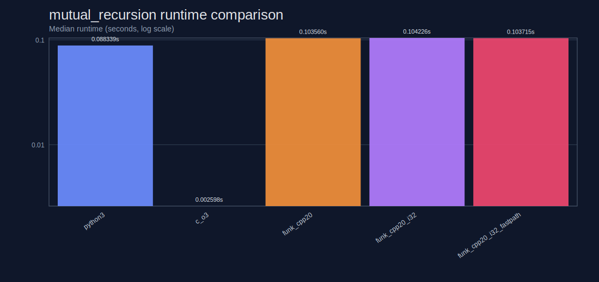
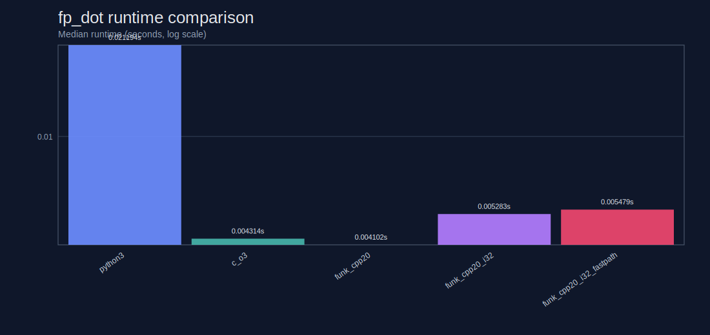
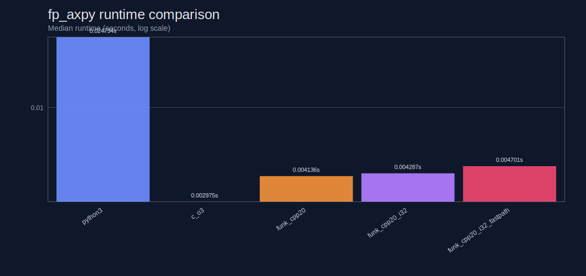
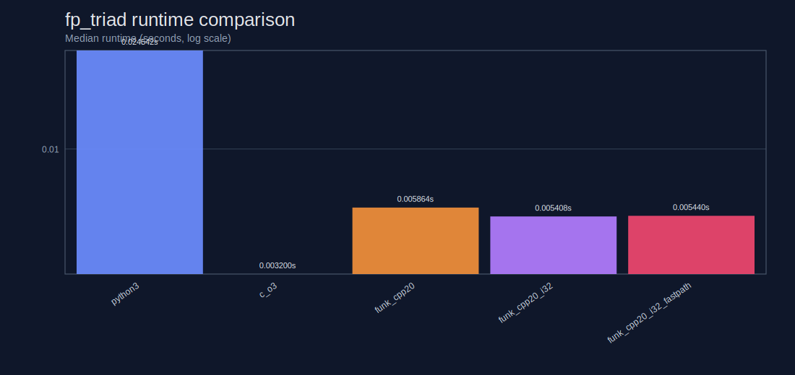

# Benchmarks
- Workload matrix:
  - `fib`: naive recursion (call-heavy, non-tail)
  - `fib_tr`: tail recursion with accumulators
  - `concat`: list-heavy concatenation/copy pressure
  - `sum_range`: integer-only tail-recursive accumulation
  - `collatz`: branch-heavy integer recursion
  - `mutual_recursion`: cross-function recursive call overhead
  - `fp_dot`: double-precision dot product reduction
  - `fp_axpy`: double-precision daxpy-style reduction
  - `fp_triad`: double-precision STREAM-like triad reduction

Auto-generated by `benchmarks/generate_report.py`.

- Runs per configuration: `7`
- Warmup runs per configuration: `1`
- Runtime metric: median wall-clock seconds
- Plot scale: logarithmic y-axis

## fib

| Variant | Python (s) | Funk (s) | C (s) | Funk/Python | Funk/C |
|---|---:|---:|---:|---:|---:|
| `funk_cpp20` | 0.645067 | 0.024486 | 0.023766 | 0.04x | 1.03x |
| `funk_cpp20_i32` | 0.641917 | 0.024566 | 0.023945 | 0.04x | 1.03x |
| `funk_cpp20_i32_fastpath` | 0.653185 | 0.024215 | 0.024179 | 0.04x | 1.00x |

## fib_tr

| Variant | Python (s) | Funk (s) | C (s) | Funk/Python | Funk/C |
|---|---:|---:|---:|---:|---:|
| `funk_cpp20` | 0.013484 | 0.003478 | 0.003214 | 0.26x | 1.08x |
| `funk_cpp20_i32` | 0.013349 | 0.003490 | 0.002800 | 0.26x | 1.25x |
| `funk_cpp20_i32_fastpath` | 0.013371 | 0.003396 | 0.002976 | 0.25x | 1.14x |

## concat

| Variant | Python (s) | Funk (s) | C (s) | Funk/Python | Funk/C |
|---|---:|---:|---:|---:|---:|
| `funk_cpp20` | 0.045770 | 0.132885 | 0.007721 | 2.90x | 17.21x |
| `funk_cpp20_i32` | 0.046079 | 0.131773 | 0.007278 | 2.86x | 18.11x |
| `funk_cpp20_i32_fastpath` | 0.046370 | 0.132163 | 0.007459 | 2.85x | 17.72x |

## sum_range

| Variant | Python (s) | Funk (s) | C (s) | Funk/Python | Funk/C |
|---|---:|---:|---:|---:|---:|
| `funk_cpp20` | 0.022306 | 0.003498 | 0.002217 | 0.16x | 1.58x |
| `funk_cpp20_i32` | 0.022063 | 0.003309 | 0.002562 | 0.15x | 1.29x |
| `funk_cpp20_i32_fastpath` | 0.022052 | 0.002575 | 0.003185 | 0.12x | 0.81x |

## collatz

| Variant | Python (s) | Funk (s) | C (s) | Funk/Python | Funk/C |
|---|---:|---:|---:|---:|---:|
| `funk_cpp20` | 0.065214 | 0.004548 | 0.004584 | 0.07x | 0.99x |
| `funk_cpp20_i32` | 0.065694 | 0.005443 | 0.004235 | 0.08x | 1.29x |
| `funk_cpp20_i32_fastpath` | 0.066080 | 0.005064 | 0.004440 | 0.08x | 1.14x |

## mutual_recursion

| Variant | Python (s) | Funk (s) | C (s) | Funk/Python | Funk/C |
|---|---:|---:|---:|---:|---:|
| `funk_cpp20` | 0.086404 | 0.003998 | 0.003189 | 0.05x | 1.25x |
| `funk_cpp20_i32` | 0.086910 | 0.003947 | 0.002734 | 0.05x | 1.44x |
| `funk_cpp20_i32_fastpath` | 0.087616 | 0.004215 | 0.002836 | 0.05x | 1.49x |

## fp_dot

| Variant | Python (s) | Funk (s) | C (s) | Funk/Python | Funk/C |
|---|---:|---:|---:|---:|---:|
| `funk_cpp20` | 0.020733 | 0.003940 | 0.002705 | 0.19x | 1.46x |
| `funk_cpp20_i32` | 0.020898 | 0.004917 | 0.003174 | 0.24x | 1.55x |
| `funk_cpp20_i32_fastpath` | 0.021084 | 0.003922 | 0.002893 | 0.19x | 1.36x |

## fp_axpy

| Variant | Python (s) | Funk (s) | C (s) | Funk/Python | Funk/C |
|---|---:|---:|---:|---:|---:|
| `funk_cpp20` | 0.021699 | 0.003851 | 0.002650 | 0.18x | 1.45x |
| `funk_cpp20_i32` | 0.022040 | 0.004763 | 0.003267 | 0.22x | 1.46x |
| `funk_cpp20_i32_fastpath` | 0.022339 | 0.004621 | 0.003002 | 0.21x | 1.54x |

## fp_triad

| Variant | Python (s) | Funk (s) | C (s) | Funk/Python | Funk/C |
|---|---:|---:|---:|---:|---:|
| `funk_cpp20` | 0.024978 | 0.005722 | 0.003384 | 0.23x | 1.69x |
| `funk_cpp20_i32` | 0.025278 | 0.005656 | 0.003138 | 0.22x | 1.80x |
| `funk_cpp20_i32_fastpath` | 0.024658 | 0.005648 | 0.003177 | 0.23x | 1.78x |

## Findings

- `fib` best Funk variant is `funk_cpp20_i32_fastpath` at `0.024215s` (0.04x vs Python, 1.00x vs C).
- `fib_tr` best Funk variant is `funk_cpp20_i32_fastpath` at `0.003396s` (0.25x vs Python, 1.14x vs C).
- `concat` best Funk variant is `funk_cpp20_i32` at `0.131773s` (2.86x vs Python, 18.11x vs C).
- `sum_range` best Funk variant is `funk_cpp20_i32_fastpath` at `0.002575s` (0.12x vs Python, 0.81x vs C).
- `collatz` best Funk variant is `funk_cpp20` at `0.004548s` (0.07x vs Python, 0.99x vs C).
- `mutual_recursion` best Funk variant is `funk_cpp20_i32` at `0.003947s` (0.05x vs Python, 1.44x vs C).
- `fp_dot` best Funk variant is `funk_cpp20_i32_fastpath` at `0.003922s` (0.19x vs Python, 1.36x vs C).
- `fp_axpy` best Funk variant is `funk_cpp20` at `0.003851s` (0.18x vs Python, 1.45x vs C).
- `fp_triad` best Funk variant is `funk_cpp20_i32_fastpath` at `0.005648s` (0.23x vs Python, 1.78x vs C).
